PHPMailer 5.2.11 added support for [Google's XOAUTH2](https://developers.google.com/gmail/xoauth2_protocol) SMTP & IMAP authentication mechanism. Using it is *very* complicated compared with other auth mechanisms, so this page is here to tell you what you need to do.

##Background
This mechanism replaces the usual username and password combination that allows you to authenticate against an SMTP server, which will then allow you to send messages through it. Since December 2014, gmail has made this their preferred method of connecting to gmail, for both sending and receiving email, and deprecated other systems. If you're not using XOAUTH2, you may experience authentication failures as described in [the troubleshooting guide](https://github.com/PHPMailer/PHPMailer/wiki/Troubleshooting). You will usually only need to set it up once for your PHP app (not each time you need to send a message), and while it's possible to share the same config across multiple apps, much of the supposed security improvement provided by OAuth stems from using separate client configs for each place you use it, so it's perfectly reasonable to create multiple Client IDs using the process shown below.

There is an earlier version of this system called `XOAUTH` (which Gmail also supports), but PHPMailer only supports the more recent `XOAUTH2`.

###Important!
The OAuth2 libraries this depends upon require **PHP 5.4 or later**, so you need to be running at least that in order to be able to use this authentication system.

##Configure an OAuth2 app
First of all you need to log into your google account using your usual username and password and go to the [developer console](https://console.developers.google.com/project). This will list any existing Google API projects you are using already and allow you to create new ones. Click the "Create Project" button:

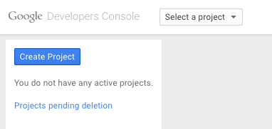

Give your project a name and select a data center (in advanced options).

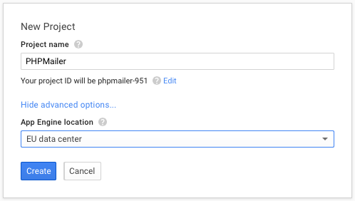

When the project has been created, click the **APIs & auth** menu, then select the **APIs** submenu.

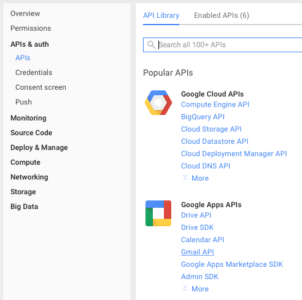

Clicking the **Gmail API** link will ask you to enable it, so click the **Enable API** button:

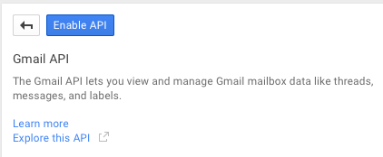

Now select **Credentials** from the left-hend menu, then click the **Create new Client ID** button:

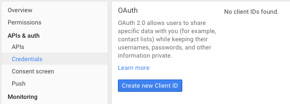

There are various different ways you can use Google's OAuth systems, but we will use the most straightforward type: **Web application**, so leave that selected and click **Configure consent screen**.

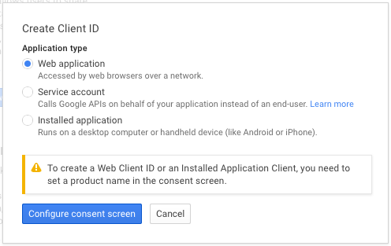

This authentication is going to use your Gmail login, so select the email address you want to use, and give this Client app a name (it doesn't have to be PHPMailer). All the other settings can be left at defaults. Then click save.

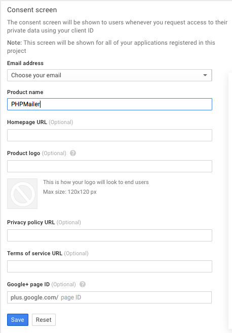

To make the client ID, select the same **Web application** option. For the purposes of this example, we don't need to worry about Javascript origins, so that can be left blank. The Authorized redirect URLs must contain a pointer to a script that will validate your OAuth request, and here we're using the script that is bundled with PHPMailer called `get_auth_token.php`, which you need to configure to be run by a web server. Here I've just used localhost - you need to be able to run the script yourself, it does not need to be accessible to the outside world, but it will need to connect to google. Click **Create client ID** and it will create the ID (amazing!):

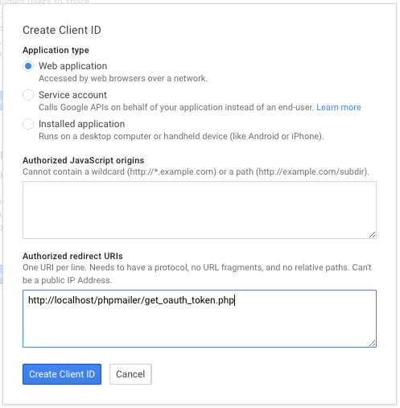

It will then show you the properties of the client ID:

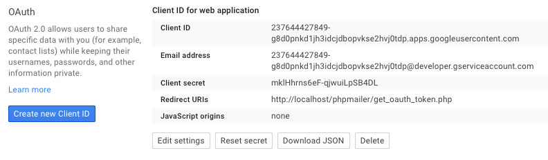

Now you need to take these values and copy and paste them into the `get_auth_token.php` script, like this:
```php
$redirectUri = 'http://localhost/phpmailer/get_oauth_token.php';
$clientId = '237644427849-g8d0pnkd1jh3idcjdbopvkse2hvj0tdp.apps.googleusercontent.com';
$clientSecret = 'mklHhrns6eF-qjwuiLpSB4DL';
```
The redirect URL needs to be set to point at the script too (yes, it does need to point at itself).

##Fetch the token
Now paste the script URL into your browser and it will ask you to select which Google ID you want to use (if you have more than one):

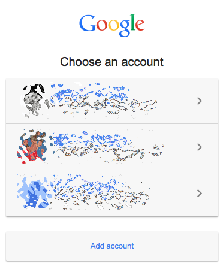

Then it will ask you for permission to allow access to this app:

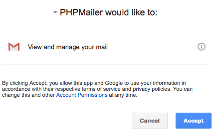

Finally it will use your redirect to reload the script, and produce a refresh token:

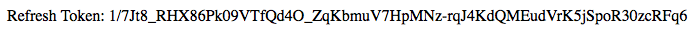

This is what we did all this work for: this value is what you need to perform XOAUTH2 authentication when connecting to Gmail's SMTP server.

##Configure your email script

In the examples folder you will find a script called `gmail_xoauth.phps` you can use as the basis for this process. How you use PHPMailer remains largely unchanged relative to the other examples; The differences are that it uses the `PHPMailerOAuth` class instead of the simpler `PHPMailer`, and you need to specify the `XOAUTH2` auth type and fill in the authentication values you obtained above.

Your gmail address goes into `oauthUserEmail` (and will generally need to be the same as your *From* address, though you can also use the **Email address** value that is shown with the Client ID above), **Client ID** goes into `oauthClientId`, **Client secret** into `oauthClientSecret` and the refresh token in `oauthRefreshToken`, like this:

```php
$mail->oauthUserEmail = "<your gmail address>@gmail.com";
$mail->oauthClientId = "237644427849-g8d0pnkd1jh3idcjdbopvkse2hvj0tdp.apps.googleusercontent.com";
$mail->oauthClientSecret = "mklHhrns6eF-qjwuiLpSB4DL";
$mail->oauthRefreshToken = "1/7Jt8_RHX86Pk09VTfQd4O_ZqKbmuV7HpMNz-rqJ4KdQMEudVrK5jSpoR30zcRFq6";
```

If you run the script with debug output enabled, you should look for a sequence like this after `STARTTLS`:

```
2015-05-21 00:45:46	CLIENT -> SERVER: EHLO Oc.local
2015-05-21 00:45:46	SERVER -> CLIENT: 250-mx.google.com at your service, [2a02:8424:2a38:e00:a102:53e4:c91f:4cff]
                   	                  250-SIZE 35882577
                   	                  250-8BITMIME
                   	                  250-AUTH LOGIN PLAIN XOAUTH2 PLAIN-CLIENTTOKEN XOAUTH
                   	                  250-ENHANCEDSTATUSCODES
                   	                  250-PIPELINING
                   	                  250-CHUNKING
                   	                  250 SMTPUTF8
2015-05-21 00:45:47	CLIENT -> SERVER: AUTH XOAUTH2 dXNlcj1tYXJjdXMuYm9pbnRvbkBnbWFpbC5jb20BYXV0aD1CZWFyZXIgeWEyOS5lZ0h5NGpXbkZaZFpMaEctV3g1ZUVtbGZiTUhqaG00Yk9BVzZETVVVamVSZDN0ZG5LOTV1bzd6ekFQcHhva3VWNjdJdEhpaWxKVnBROFEBAQ==
2015-05-21 00:45:47	SERVER -> CLIENT: 235 2.7.0 Accepted
```
That `235 2.7.0 Accepted` tells us thet the authentication was accepted, and now we can go ahead with sending our message.